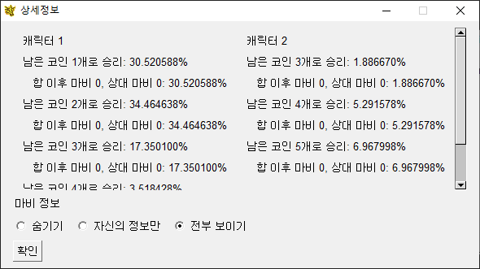

# 림버스 합 계산기

행렬곱을 이용해 비교적 빠르게 합 승률을 계산합니다.

(코인 40개끼리 붙이는 정도면 노트북에서 2초정도 걸림)

위력 기댓값은 마지막 공격의 위력입니다. 전체 피해량을 반영하지 않습니다.

합 종료시 코인 몇 개 남을지에 대한 확률도 확인할 수 있습니다.

# Limbus Clash Calculator

Calculate clash win rate relatively fast using matrix multiplication.

(It takes about two seconds in laptop with clash between 40 coins.)

'power expected value' is expected value of the last power of the attack. Does not reflect net. damage.

It also can calculate how many coins will left when clash end.

